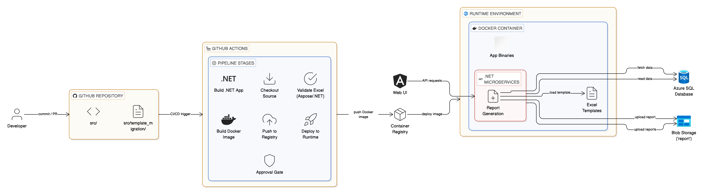

# Template as Application Asset (Docker Embedded)

## Overview

**Template as Application Asset** is an architectural pattern where Excel templates are
**packaged directly into Docker images** and treated as part of the application binary.

At runtime:
- Templates are read from the container filesystem
- Azure Blob Storage is used only for generated reports

---

## When Should You Use This Pattern?

This pattern is suitable when:

- Templates are tightly coupled with application logic
- Immutable runtime environments are preferred
- Redeploying services for template changes is acceptable
- You want to eliminate external template dependencies

---

## Architecture Summary

**Key characteristics:**
- Templates embedded in Docker image
- No Azure Blob Storage for templates
- Blob Storage used only for reports
- Code + templates versioned together



---

## Developer Responsibilities

- Modify templates only under `src/template_migration/`
- Commit template changes via Git
- Accept redeploys for template changes
- Read templates from filesystem, not Blob

---

## DevOps Responsibilities

- Embed templates during Docker build
- Maintain Docker-based CI/CD pipeline
- Deploy updated images to runtime
- Manage Blob Storage for reports only

---

## Configuration Model

Templates are read from filesystem using configuration:

```json
{
  "TemplateSettings": {
    "Provider": "FileSystem",
    "BasePath": "/app/templates"
  }
}
