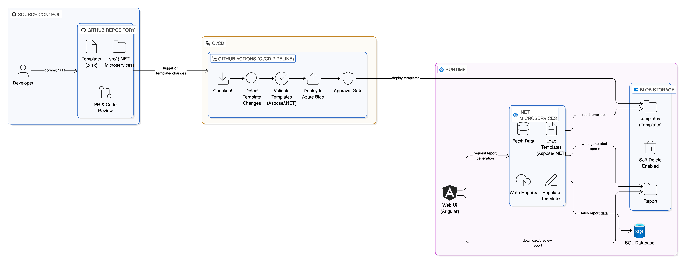

# Template as Code (TAAC)

## Overview
Templates are treated as configuration artifacts:
- Stored in GitHub
- Validated via CI/CD
- Deployed to Azure Blob Storage

## When to Use
- Templates change rarely
- Template-only fixes must not trigger redeploys
- Multiple services consume templates

## Architecture

## Detailed Design
See full document:
- Template_as_Code_TAAC.pdf
